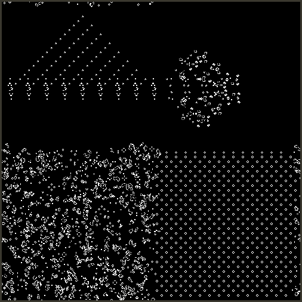

# Game of Speed

Conway's Game of Life as fast as possible.

(Pictured above is the "benchmark" world)

## Gettings started

### Running the app

`make`

Requires:

- https://www.libsdl.org/

### Running the tests

`make test`

Requires:

- https://github.com/catchorg/Catch2

### Running a benchmark

`make benchmark`

Requires:

- https://github.com/google/benchmark

## Milestones

### THREADS% speed increase in logic

Finally gave in to the lazy performance improvement, throwing more threads at the problem.

[2f68783cc8a3d9bd7590e617b71a5a0df010af56](https://github.com/Jumbub/game-of-speed/commit/2f68783cc8a3d9bd7590e617b71a5a0df010af56)

### ∞% speed increase in rendering

Segmented the rendering and computation into separate threads. _At this stage_ the rendering takes less time than the computation, so effectively I've reduced render time to 0.

[2619b4164bd2fca3fd8b30dca22cd83a75fe43b9](https://github.com/Jumbub/game-of-speed/commit/2619b4164bd2fca3fd8b30dca22cd83a75fe43b9)

### 188% speed increase in logic

Only compute the y levels for the above and below cells once per row.

[9e80c59830588b05ee29c754530fabf50f51a9e0](https://github.com/Jumbub/game-of-speed/commit/9e80c59830588b05ee29c754530fabf50f51a9e0)

### 215% speed increase in logic

Reduced the number of neighbour checks from 8 (all) to 3.

Achieved by having a "sliding window" of the neighbour counts for the "left", "middle" and "right" neighbouring columns. When the next cell computes it's neighbours it shifts the window over (so "middle" becomes "left") and only has to generate the new "right" column.

[01cce885bd57f1a5aa4d113a32f4413a61f826a5](https://github.com/Jumbub/game-of-speed/commit/01cce885bd57f1a5aa4d113a32f4413a61f826a5)

### 183% speed increase in logic

Removing the shared\_ptr wrappers, speed > safety.

[73e6448fe2a021d9063bf50323b4b99cd551ee15](https://github.com/Jumbub/game-of-speed/commit/73e6448fe2a021d9063bf50323b4b99cd551ee15)

### 350% speed increase in rendering

Rendering the board logic, rather than creating a list of pixels to render.

[cda613a50c4314d087152fb26cf222c76d5ea92d](https://github.com/Jumbub/game-of-speed/commit/cda613a50c4314d087152fb26cf222c76d5ea92d)

### 200% speed increase in logic

Merging and inlining the "finding neighbour positions" and "counting neighbours" logic.

[f64f4adbf7c6f956d2edcff397483de44ccaabec](https://github.com/Jumbub/game-of-speed/commit/f64f4adbf7c6f956d2edcff397483de44ccaabec)

### 625% speed increase in logic

Switching from a 2D vector `std::vector<std::vector<bool>>` to a 1D array `std::unique_pr<new bool[]>`.

[9284f489604e814bb362fe5aa0c5e41ec5158edc](https://github.com/Jumbub/game-of-speed/commit/9284f489604e814bb362fe5aa0c5e41ec5158edc)

### Functioning prototype

Finalised the benchmark board.

[9227c6a55ede200a1b6fe827c93010963e704f3d](https://github.com/Jumbub/game-of-speed/commit/9227c6a55ede200a1b6fe827c93010963e704f3d)

## References

Great util for generating binary image files:
https://www.dcode.fr/binary-image
